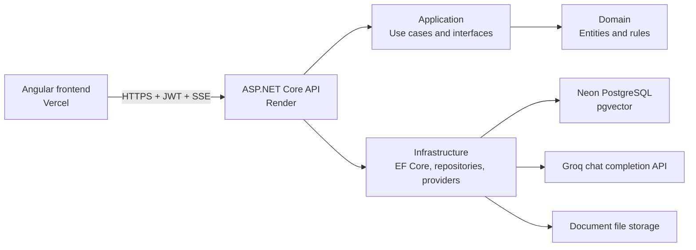

# AI Knowledge Assistant

> A full-stack document intelligence platform that turns uploaded PDF and DOCX files into a searchable knowledge base with grounded, cited AI answers.

[Live Frontend](https://ai-knowledge-assistant-seven.vercel.app) | [Live API](https://ai-knowledge-assistant-api-h4bx.onrender.com) | [API Health](https://ai-knowledge-assistant-api-h4bx.onrender.com/health/live)

The primary workflow is:

**Register or Login -> Upload Document -> Background Indexing -> Ask Questions -> Stream a RAG Answer with Sources**

## Features

- JWT authentication with rotating refresh tokens and logout support
- Role-based access control for User and Admin roles
- PDF and DOCX upload, validation, versioning, re-indexing, and soft deletion
- Asynchronous text extraction, chunking, embedding, and pgvector indexing
- Retrieval-augmented generation (RAG) chat grounded in uploaded documents
- Streaming responses over Server-Sent Events (SSE)
- Compact source citations grouped by document and chunk
- Conversation history, renaming, archiving, pagination, and feedback
- Admin user management, role management, analytics, and RAG diagnostics
- Responsive Angular UI with document status polling and guarded settings
- Structured logging, correlation IDs, rate limiting, health checks, and OpenTelemetry foundations

## Live Demo

| Service | URL |
| --- | --- |
| Angular frontend | `https://ai-knowledge-assistant-seven.vercel.app` |
| ASP.NET Core API | `https://ai-knowledge-assistant-api-h4bx.onrender.com` |
| Liveness check | `https://ai-knowledge-assistant-api-h4bx.onrender.com/health/live` |

The API root intentionally returns `404`; use API routes or the health endpoints. Render's free service may need time to wake up on the first request.

## Screenshots

Portfolio screenshots can be added using these stable paths:

| Screen | Placeholder |
| --- | --- |
| Dashboard | `docs/screenshots/dashboard.png` |
| Documents | `docs/screenshots/documents.png` |
| Chat with sources | `docs/screenshots/chat.png` |
| Settings | `docs/screenshots/settings.png` |
| Admin dashboard | `docs/screenshots/admin.png` |

See [docs/screenshots/README.md](docs/screenshots/README.md) for the capture checklist.

## Tech Stack

| Layer | Technology |
| --- | --- |
| Frontend | Angular 21, TypeScript, Angular Material, Bootstrap 5, RxJS, Signals, SCSS |
| API | .NET 8, ASP.NET Core Minimal APIs, Swagger/OpenAPI |
| Application | Clean Architecture, dependency injection, FluentValidation patterns |
| Data | PostgreSQL, Neon, Entity Framework Core, pgvector |
| AI | Groq (`llama-3.1-8b-instant`), provider abstraction, local hash embeddings |
| Documents | Open XML SDK, iText, background processing |
| Security | JWT access tokens, refresh-token rotation, RBAC, rate limiting, CORS |
| Observability | Serilog, correlation IDs, health checks, OpenTelemetry foundation |
| Hosting | Vercel frontend, Render API, Neon PostgreSQL |
| Delivery | Docker, Docker Compose, GitHub Actions |

## Architecture

The backend follows Clean Architecture: Domain and Application contain business rules and contracts; Infrastructure implements persistence, AI providers, storage, and external integrations; the API is the delivery layer.



### Projects

- `ai-knowledge-assistant.Domain`: entities, enums, and domain constants
- `ai-knowledge-assistant.Application`: DTOs, interfaces, use cases, validation, and RAG orchestration
- `ai-knowledge-assistant.Infrastructure`: EF Core, Neon/PostgreSQL, pgvector, document processing, AI providers, and repositories
- `ai-knowledge-assistant.Api`: endpoints, middleware, authentication, authorization, Swagger, health, and observability
- `ai-knowledge-assistant-ui`: standalone Angular application and responsive feature UI
- `ai-knowledge-assistant.UnitTests`: focused business and provider tests
- `ai-knowledge-assistant.IntegrationTests`: API workflow and authorization tests

## Local Setup

Prerequisites: .NET 8 SDK, Node.js 20+, npm, Docker Desktop, and EF Core CLI 8.x.

```powershell
git clone https://github.com/YOUR_GITHUB_USERNAME/ai-knowledge-assistant.git
cd ai-knowledge-assistant
Copy-Item .env.example .env
```

Replace every placeholder in `.env` with a local-only value. Never commit `.env` or `appsettings.Development.json`.

Start PostgreSQL with pgvector:

```powershell
docker compose up -d postgres
dotnet ef database update --project .\ai-knowledge-assistant.Infrastructure --startup-project .\ai-knowledge-assistant.Api
```

Run the API:

```powershell
dotnet restore
dotnet run --project .\ai-knowledge-assistant.Api --launch-profile http
```

The API runs at `http://localhost:5160`; Development Swagger is at `http://localhost:5160/swagger`.

Run the frontend in another terminal:

```powershell
cd .\ai-knowledge-assistant-ui
npm install
npm start
```

The frontend runs at `http://localhost:4200` and calls `http://localhost:5160/api` in Development.

For detailed instructions, see [docs/local-setup.md](docs/local-setup.md).

## Database Setup

Local development uses `pgvector/pgvector:pg16`. Production uses Neon PostgreSQL.

```sql
CREATE EXTENSION IF NOT EXISTS vector;
```

Apply migrations with a direct PostgreSQL connection:

```powershell
$env:ConnectionStrings__DefaultConnection = "YOUR_DIRECT_CONNECTION_STRING"
dotnet ef database update --project .\ai-knowledge-assistant.Infrastructure --startup-project .\ai-knowledge-assistant.Api
Remove-Item Env:ConnectionStrings__DefaultConnection
```

Use Neon's pooled connection for the running Render service and its direct connection for migrations.

## Environment Variables

The root [.env.example](.env.example) contains safe placeholders for local Docker and backend configuration.

| Variable | Purpose | Secret |
| --- | --- | --- |
| `ConnectionStrings__DefaultConnection` | PostgreSQL/Neon connection | Yes |
| `Jwt__SigningKey` | JWT signature key, minimum 32 characters | Yes |
| `Jwt__Issuer` | Access-token issuer | No |
| `Jwt__Audience` | Access-token audience | No |
| `AI__Provider` | `Groq`, `Ollama`, `OpenAI`, or `AzureOpenAI` | No |
| `AI__ApiKey` | Selected provider API key | Yes |
| `AI__Endpoint` | Provider completion endpoint | No |
| `AI__Model` | Chat model name | No |
| `AI__EmbeddingModel` | Embedding model or `local-hash-embedding` | No |
| `Storage__UploadsPath` | Writable upload directory | No |
| `Cors__AllowedOrigins__0` | Allowed Angular origin | No |
| `Swagger__Enabled` | Temporary production Swagger switch | No |

Angular uses compile-time environment files rather than runtime secrets:

- `environment.development.ts`: local API
- `environment.production.ts`: Render API

## Deployment

- **Frontend:** Vercel builds `ai-knowledge-assistant-ui` and serves `dist/ai-knowledge-assistant-ui/browser`.
- **API:** Render builds `ai-knowledge-assistant.Api/Dockerfile` using the root Docker context.
- **Database:** Neon hosts PostgreSQL and pgvector; EF Core migrations use the direct Neon endpoint.
- **AI:** Render receives the Groq API key through secret environment variables.

See [docs/deployment.md](docs/deployment.md) and [docs/deployment-render-neon.md](docs/deployment-render-neon.md).

## Testing

Backend:

```powershell
dotnet restore
dotnet build
dotnet test
```

Frontend:

```powershell
cd .\ai-knowledge-assistant-ui
npm install
npm run build
npm test -- --watch=false
```

The test projects use fake AI and embedding providers; tests do not call Groq or other paid APIs. Follow [docs/manual-test-flow.md](docs/manual-test-flow.md) for end-to-end verification.

## Known Limitations

- Local hash embeddings are used for the zero-cost MVP and are less accurate than a production embedding model.
- OCR is not implemented; scanned or handwritten PDFs may fail text-quality validation.
- Render's free service may sleep, making the first request slow.
- Groq free-tier rate limits and availability may affect chat responses.
- Render's local filesystem is ephemeral, so durable production uploads require object storage.

See [docs/known-limitations.md](docs/known-limitations.md) for details and mitigations.

## Future Improvements

- Replace local hash embeddings with a real multilingual embedding model
- Add zero-cost OCR support and extraction confidence reporting
- Add document-level summarization and selected-document chat
- Expand analytics, evaluation, reranking, and retrieval diagnostics
- Add multi-tenant organizations and workspace-level permissions
- Move uploads to S3-compatible durable object storage
- Add email invitations, password reset, and account verification

## Documentation

- [Local setup](docs/local-setup.md)
- [Deployment overview](docs/deployment.md)
- [Render and Neon deployment](docs/deployment-render-neon.md)
- [Manual test flow](docs/manual-test-flow.md)
- [Known limitations](docs/known-limitations.md)
- [Render verification](docs/render-verification.md)
- [Vercel/Render CORS](docs/vercel-render-cors.md)
- [OCR roadmap](docs/ocr-roadmap.md)
